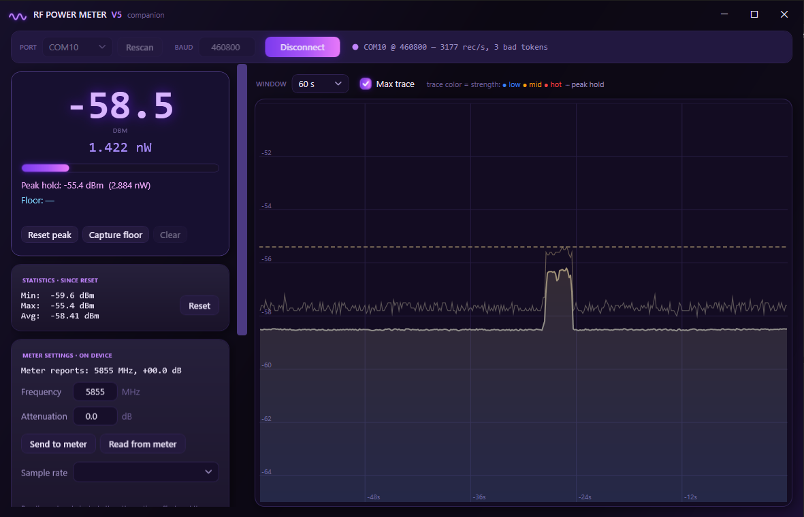

# RF Power Meter V5 Companion

**An open-source Windows app for the Chinese "USB RF Power Meter V5" (STM32F401CCU6 + AD8317/AD8318 log detector) that replaces the vendor software — and the first public documentation of its serial protocol.**

[](https://github.com/LostInNovo/rf-power-meter-v5-companion/releases/latest)

   

Are you tired of downloading dodgy-ass software from a file host you've never heard of, just to talk to an STM32 + AD8317 board that literally streams dBm over a serial port? Same. So this exists.

It speaks the **stock firmware's protocol** — nothing gets flashed, your factory calibration stays exactly where it is — and it does everything the vendor app does, minus the part where the UI looks like Windows XP had a rough night, plus a bunch of stuff the vendor app can't do at all.



## What it does

- **Live readout**: big honking dBm number, auto-scaled watts (pW → W), signal bar
- **Peak hold** with reset, drawn as a dashed line on the chart
- **Scrolling chart** (10 s / 30 s / 60 s / 5 min) with average + max-envelope traces — sweep an antenna around, watch where it peaks
- **Min / Max / Avg** running statistics
- **Noise-floor tare**: click = 1 s average, *hold the button* = average for as long as you hold. Then it shows you Δ above floor AND the floor-corrected net power (subtracted in watts, like it should be — readings 2 dB above the floor are mostly floor, and this does the math for you)
- **Threshold trigger**: timestamps an entry every time the level crosses your threshold (debounced, auto re-arms) — catch transmitter power-ups while you're not looking
- **Frequency + attenuation control**: both stored on the meter itself; the frequency selects the meter's on-board band calibration (5880 for 5.8 GHz FPV, 2400 for WiFi, etc.)
- **Sample rate control**: all 18 of the meter's burst rates (500 kSa/s down to 61 Sa/s), labeled with what they actually do
- **CSV logging**: timestamped 50 ms bins (avg/min/max/samples), straight into Documents

And the part that took actual work: **the full serial protocol, reverse-engineered and verified against real hardware, is documented in [PROTOCOL.md](PROTOCOL.md)**. Live byte captures + a decompile of the vendor exe, cross-checked. Want to write your own client in Python on Linux? Everything you need is in there.

## Download & run (just want the app)

**[⬇ Grab the latest release](https://github.com/LostInNovo/rf-power-meter-v5-companion/releases/latest)**, unzip, run `RfMeterGui.exe`. That's it:

- **No .NET install needed** — it's a self-contained Windows x64 build, everything's in the exe.
- Windows SmartScreen will flag it ("Windows protected your PC") because it's an unsigned indie build. Click **More info → Run anyway**. Don't trust a random exe? Good instinct — the entire source is right here, [build it yourself](#or-build-it-yourself) instead.

You need: the meter (sold as "USB RF Power Meter V5", "RF Power Meter V5.0", or similar — STM32F401CCU6 + AD8317/AD8318, USB-C, shows up as a serial port), and any 64-bit Windows.

Pick your COM port (it auto-selects if it finds one), 460800 baud is pre-filled, hit Connect. Data flows immediately — the meter free-runs, no handshake dance.

Optional CLI flags: `--autoconnect`, `--log` (start CSV logging immediately), `--size=1000x650` (open at a given size).

## Or build it yourself

Needs the [.NET 7 SDK](https://dotnet.microsoft.com/download/dotnet/7.0).

```
git clone https://github.com/LostInNovo/rf-power-meter-v5-companion
cd rf-power-meter-v5-companion
dotnet build src/RfMeterGui/RfMeterGui.csproj -c Release
src/RfMeterGui/bin/Release/net7.0-windows/RfMeterGui.exe
```

To reproduce the self-contained single-file release build:

```
dotnet publish src/RfMeterGui/RfMeterGui.csproj -c Release -r win-x64 --self-contained true -p:PublishSingleFile=true -p:IncludeNativeLibrariesForSelfExtract=true
```

## Three things the manual will never tell you

1. **The meter forgets everything on power-cycle.** Frequency, attenuation, sample rate — all RAM-only. Replug it and it boots at 1 MHz (yes, one). The app shows you what the meter *actually* reports on connect, so a wrong band is visible at a glance. Re-send your frequency after every replug.
2. **The stream is bursts, not a steady drip.** Every block of 500 samples is captured at the K-rate's real sample period (down to 2 µs/sample = 500 kSa/s), then shipped over the wire in ~158 ms. That's how the vendor app does µs-scale envelope markers over a 46 kB/s serial link. Details in [PROTOCOL.md](PROTOCOL.md).
3. **There is one command that corrupts the meter's state** (the truncated form of the settings command). This app refuses to send it, by construction, in the protocol layer. If you're writing your own client: read the protocol doc *before* you freestyle bytes at the parser. Recovery is documented too — nobody's meter died making this software.

## How not to fry it (read this once, seriously)

The AD8317/AD8318 input dies at about **+12 dBm**. Instantly. Not "gets warm" — dies.

- **Never connect a transmitter directly.** A 25 mW "pit mode" VTX is already +14 dBm. Your 2 W VTX is +33 dBm — that's 100× past the limit.
- Measuring real power = **attenuators**: 30 dB / ≥10 W rated brick first (and rated for your frequency — a DC–3 GHz pad at 5.8 GHz is a paperweight), then a small 10–20 dB pad. Land the signal between −50 and −5 dBm, type the total pad value into the attenuation field, and the meter adds it back on-board.
- **Sniffing with a bare SMA connector is safe** at any sane distance — a bare connector at 5.8 GHz is effectively a −50 dBi "antenna". With an actual antenna on the meter near a 2 W transmitter: keep > 0.5 m and back off if you see −10 dBm.
- Readings above ~−5 dBm are compressing and under-reading anyway. If the number stops going up, you're not measuring anymore, you're begging.

## FAQ

**Will this brick my meter?** No. It's read-only except for the three documented commands, and the dangerous malformed variant is structurally impossible to send through this code.

**Linux/macOS?** The app is WPF, so no — but [PROTOCOL.md](PROTOCOL.md) has everything: 460800 8N1, split the stream on `u`/`m`/`w`, parse the dBm out of each record. A Python client is an afternoon.

**My readings are a few dB off at 5.8 GHz.** Set the frequency field — the meter picks its band calibration from it. Absolute accuracy on these boards is ±2–3 dB territory regardless; relative measurements (A/B antenna tests, power steps) are much tighter.

**The reading barely moves above the noise floor when sniffing.** That's physics, not a bug. Use the floor tare to read the actual delta, and remember a signal 2 dB above the floor is ~60% floor by power.

## Credits & provenance

Protocol reverse-engineered 2026-06-12 from live serial captures on real hardware, cross-validated against an IL decompile of the vendor's `USB-RF-Power-Meter.exe`. The capture tool used is included in [`tools/capture.ps1`](tools/capture.ps1) — point it at your COM port and verify your unit behaves the same before trusting anything.

MIT licensed. Do whatever, just don't blame me for your detector.

---

*Search-engine breadcrumbs, since you probably got here from one: USB RF Power Meter V5 software, RF Power Meter V5.0 Windows app, USB-RF-Power-Meter alternative, AD8317 USB power meter GUI, AD8318 power meter software, STM32 RF power meter serial protocol, RF Power Meter V5 driver download (you don't need a driver, it's CDC serial), 8 GHz USB power meter open source.*
